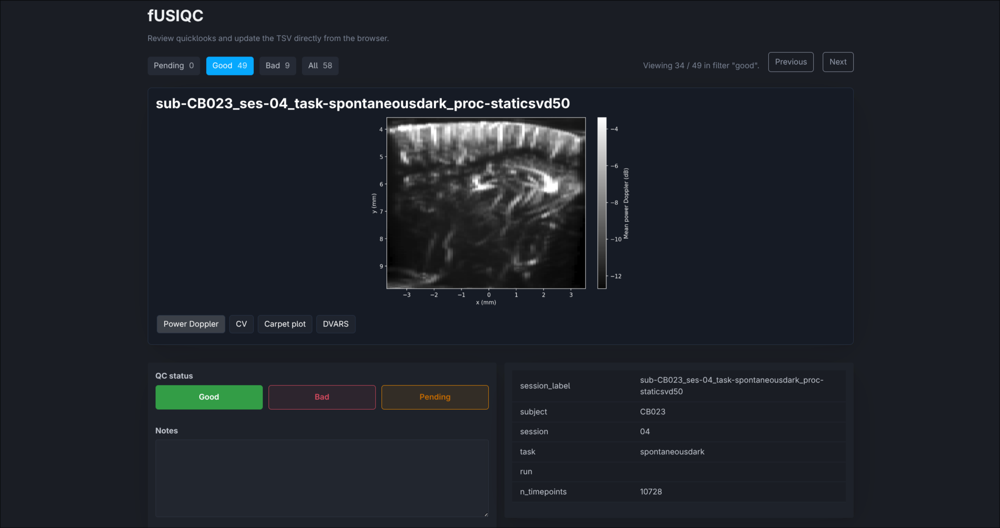

[](https://pypi.org/project/fusiqc/)
[](https://pypi.org/project/fusiqc/)
[](LICENSE)

# fUSIQC

> [!NOTE]
> fUSIQC explores what a web-based QC app for [ConfUSIus](https://confusius.tools) could
> look like. Although it is a proof of concept, it may still be useful if you need to
> perform quick quality control of a fUSI-BIDS dataset.

Browser-based quality control for fUSI-BIDS datasets, powered by
[ConfUSIus](https://confusius.tools). Generates QC plots (mean power Doppler,
coefficient of variation, carpet plot, DVARS) for each recording and serves a local web
app to review and annotate them. QC figures are saved to a derivatives folder for easy
inspection, and annotations are persisted to a TSV file for downstream analyses.



## Usage

```bash
uv run fusiqc /path/to/bids-root
```

On first run, QC plots are generated for all recordings. Subsequent runs reuse existing
plots and only compute missing ones. Pass `--refresh` to force regeneration.

### Options

| Flag | Default | Description |
|---|---|---|
| `--output-dir` | `<bids_root>/derivatives/fusiqc/` | QC output directory |
| `--host` | `127.0.0.1` | Host to bind the web app |
| `--port` | `8765` | Port to bind the web app |
| `--workers` | `min(8, cpu_count - 1)` | Parallel workers for plot generation |
| `--refresh` | | Force regeneration of all QC plots |
| `--no-browser` | | Don't open a browser automatically |

## Output

- `<output_dir>/figures/` — QC plot PNGs organized by subject/session
- `<output_dir>/quality-control.tsv` — QC status and annotations
